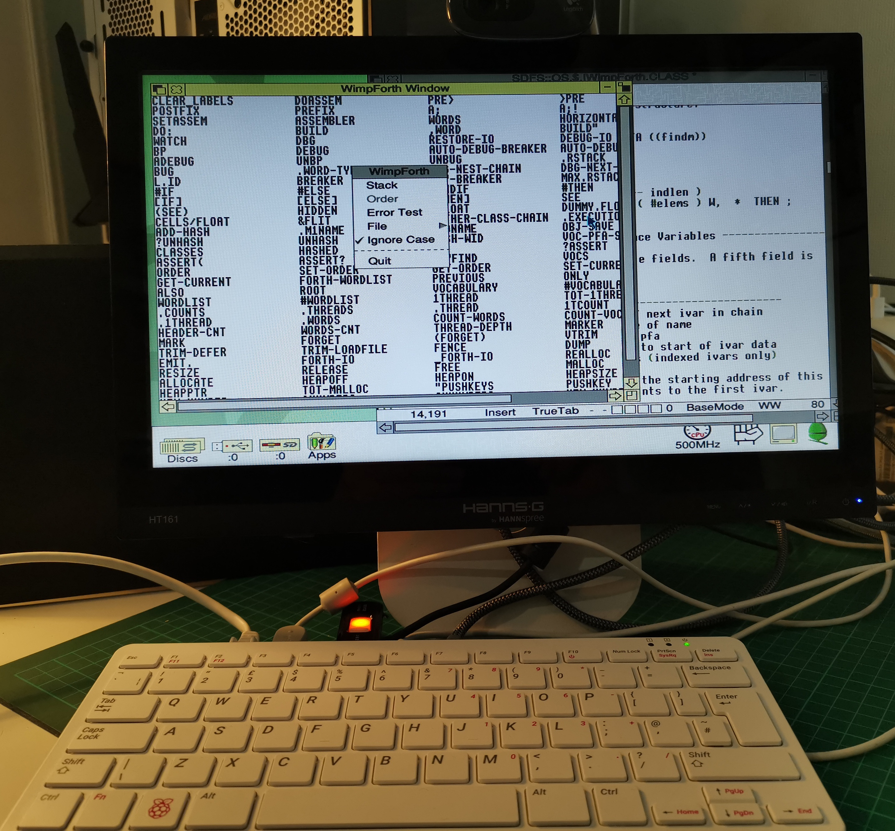
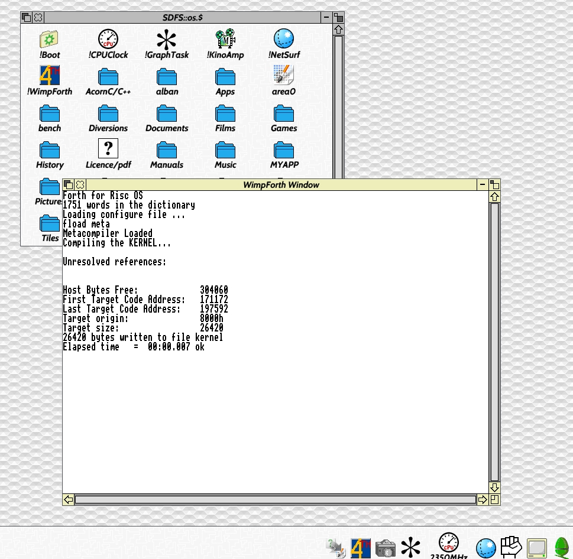
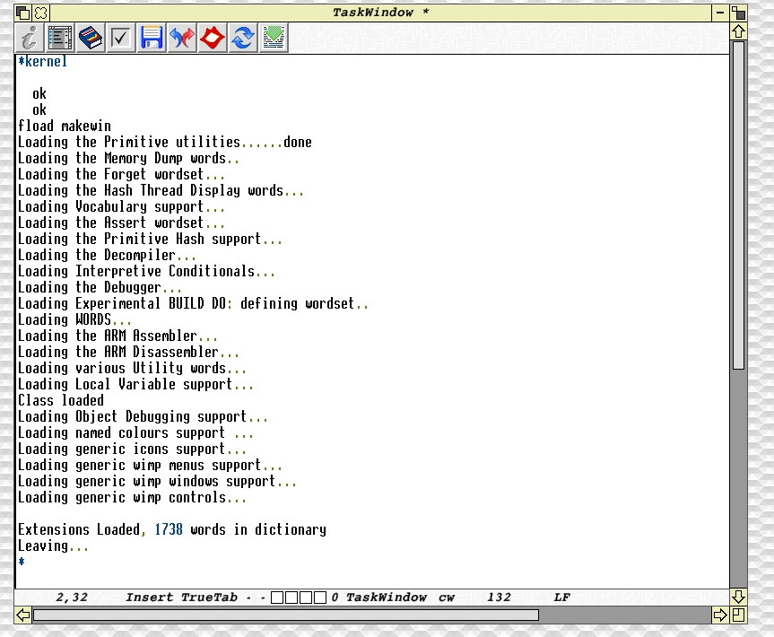

# FORTH

!WimpForth (Wimp being windows icons mouse and pointers)

This RISC OS FORTH by Martin Läuter is inspired by Win32Forth by Andrew McKewan and Tom Zimmer

I updated this ever so slightly to get it to work on my 200Mhz RISC PC back in the day.

I still run RISC OS; and run this FORTH; these days on a ~~1.5Ghz~~ 2.35Ghz processor. 

Presently has some bugs with the CARET display.


Selfie 




In theory all you need is the source and the Kernel file (which is a binary) to get started.

These can be found in the WF ZIP file for RISC OS.

## Meta Compiler

This FORTH is very interesting since (true to its Win32Forth roots) it is a meta compiler.

From a working kernel this FORTH is able to recompile itself; this is true to the FORTH philosophy; 
and different from many micro (z80, 6502) forths where to bootstrap you needed to use an assembler (if you were lucky); 
or enter the hex into a machine monitor and patch it (I have done that, fun three weeks.)

The idea being  that as long as you have a computer running this FORTH `all` you need to do is re-write the assembler for another architecture; rewrite some kernel code words in that assembler; and re-generate the kernel to the new target system using the meta compiler.

Thanks to the meta-compiler once you have FORTH; FORTH can build your next FORTH, for ever.

I guess that the original author may have done that; probably starting from the PC version this descends from.

This capability has been useful over the years; when updating to run on new versions of the Systems that run RISC OS.

The original author granted permissions to copy and use the software; see !HELP file.


## Rebuild all

Unzip the wf/zip file to your desk.

Start !WimpForth

To completely rebuild 
You can optionally edit and rebuild the kernel.
And then use your new kernel to rebuild the app.

# Kernel



# Make app




To make any changes to the FORTH you just edit the FKERNEL and other files, especially WINDOWS

This app has made its way from the Archimedes to RISC PC IYONIX and finally the PI400 by repeatedly doing the above, making very small changes along the way.


## Fun things

The forth interpreter NEXT is only one instuction on the ARM 32.

```FORTH
: next
    >pre ldr pc, [ ip ], # 4
    pre> ;
```


The assembler supported is classic RISC 

- the built in portable assembler implements just the ARM2 instructions as supported by the Archimedes.  


## Recent History Summary

### Reverse order newest first.

Added orange coloured cursor to the edit window, handle caret events, avoid drawing on other peoples windows, fixed bug that sometimes stopped the icon from displaying in the icon bar.


